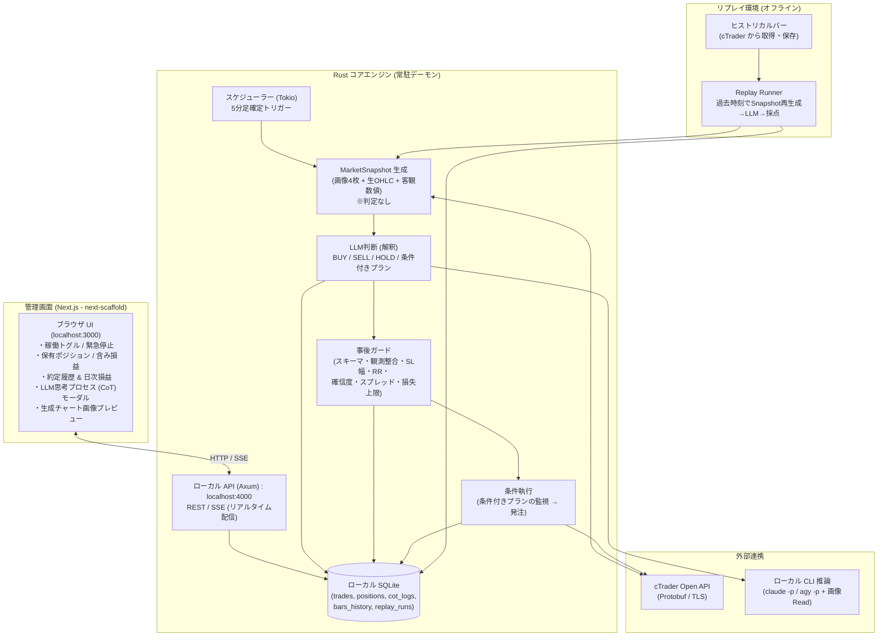

# 01. システム全体アーキテクチャ

## 1. 全体像

本システムは、ローカル環境で完結する自動売買システムです。
外部クラウドへのSaaSデプロイは行わず、手元のマシンで常駐する **Rustコアエンジン** と、ローカルブラウザから操作・監視する **Next.js管理画面（next-scaffoldベース）** で構成されます。



### パイプラインの原則
- **Snapshot は判定しない**: ピンバー・トレンド・サポレジといったラベルは生成しません。画像、生OHLC、数値（ATR、前日高安、キリ番、スイング価格リスト）のみを組み立てます。
- **Guard は事後に働く**: LLMの出力を受け取ってから機械的に検証します。入力前にLLMの相場観を狭めません。
- **Executor は条件を待てる**: LLMが「〇〇を実体で抜けたら買い」という条件付きプランを返した場合、5M確定ごとに条件を評価し、成立時はLLMを再呼び出しせずにGuardを通して発注します。
- **Live と Replay は同じ Snapshot を通る**: リプレイ環境は過去時刻を指定して同じ `MarketSnapshot` を生成するため、本番と評価でLLMが見るものが一致します。

---

## 2. 管理画面（Next.js / next-scaffold）の設計

プロジェクト内の `dashboard/`（または `web/`）に配置し、`bee8` プロジェクトの `next-scaffold` をベースに構築します。

### 主な画面・UI機能
1. **ダッシュボード概要 (`DashboardLayout`)**:
   - **稼働状態コントロール**: ボットの稼働/一時停止/緊急停止（Circuit Breaker）のワンクリック切り替えスイッチ。
   - **サマリーメトリクス (`Card`)**: 口座残高、本日の確定損益、保有含み損益、本日の勝率、現在スプレッド。
2. **ポジション一覧 (`Table`, `Badge`)**:
   - 通貨ペア、売買方向（BUY: 緑, SELL: 赤）、ロット数、エントリー価格、現在価格、SL/TP価格、損益pips。
   - 手動決済ボタン（緊急時の手動イグジット）。
3. **LLM思考プロセス（CoT）履歴ビューア (`Dialog`, `Sheet`)**:
   - **最重要機能**: 「なぜその判断（BUY/SELL/HOLD）を下したのか」を一覧から選択し、詳細モーダルで確認。
   - 確信度、環境認識、注文の攻防の読み、シナリオ無効化価格（SLの理由）、反対材料、条件付きプラン。
   - ガードで弾かれた判断は、どのガードで弾かれたかをバッジ表示。
4. **チャートプレビュー**:
   - 直近の推論時に `plotters` で自動生成された時間足ごとの4枚（4H/1H/15M/5M）のローソク足チャート画像をタブまたはグリッドで表示。LLMが見たものと同一の画像を表示する。
5. **教訓（Lessons Learned）マネージャー**:
   - 損切り後に自動蓄積された「失敗の教訓リスト」を閲覧・編集・無効化できる設定画面。
6. **条件付きプラン監視**:
   - 現在保持している `conditional_plan`（待ち条件、無効化条件、期限）を表示。手動破棄ボタン。
7. **リプレイ結果ビューア**:
   - リプレイ実行の一覧と、確信度別勝率、方向一致率、無効化ライン精度などの集計を表示。

---

## 3. Rust コアエンジンの設計

Rust 1.98（Tokio非同期ランタイム）を採用し、常駐デーモンとして24時間安定稼働します。

### 主要モジュール
- **`ctrader`**: cTrader Open APIとProtobuf通信を行い、リアルタイムTickおよび5M/15M/1H/4HのTrendbarsを取得。リプレイ用に指定期間のヒストリカルバーを一括取得する機能も持つ。
- **`snapshot`**: 指定時刻（本番は現在、リプレイは過去）における `MarketSnapshot` を組み立てる。中身は時間足ごとのチャート画像4枚、15M/5Mの生OHLC、ATR・前日高安・当日高安・セッション高安・キリ番・スイング高安のリスト。**判定ロジックは含まない**。
- **`chart`**: `plotters` で時間足ごとに1枚のPNGを生成。ローソク足、EMA、価格ラベル付き水平線、現在価格のみを描く。パターン名や強調枠は描かない。
- **`llm`**: `claude -p` をサブプロセス実行し、画像パスを含むプロンプトを渡して `TradeDecision` を取得。`LlmBackend` トレイトで抽象化し、将来API直叩きに差し替え可能にする。
- **`guard`**: LLM出力の事後検証。スキーマ、観測整合、SL方向・幅、RR、確信度、スプレッド、指標ブラックアウト、ポジション上限、日次損失。全ての判定結果をCoTログに残す。
- **`executor`**: 条件付きプランの保持と5M確定ごとの評価、成立時の発注。cTrader Open APIへサーバーサイドSL/TP付きで発注。
- **`replay`**: ヒストリカルバーから過去の任意時刻で `snapshot` を再生し、LLM判断を採点・集計する。詳細は [06_replay_environment.md](./06_replay_environment.md)。
- **`server`**: `axum` による軽量HTTPサーバー。Next.js管理画面に対してREST APIおよびSSE（Server-Sent Events）を提供。
- **`storage`**: `sqlx` / `rusqlite` によるSQLite永続化。トレード、ポジション、CoTログに加え、ヒストリカルバーとリプレイ結果を保存。

### 現行コードからの移行
現在の `src/strategy/features.rs` にある `PriceActionAnalyzer` はパターン判定・トレンドラベル・キーレベル判定を行っており、この設計と矛盾します。EMA計算、スイング検出、キリ番算出といった**測定関数は `snapshot` に移し**、ラベルを生成する部分は削除します。`src/chart/plotter.rs` のパターン表示と強調枠も削除します。

---

## 4. ローカルCLI（`claude -p` / `agy -p`）との連携設計

SaaS APIキーを直接埋め込むのではなく、ローカルに導入済みのCLIツールをサブプロセス経由でパイプ連携させます。

### 画像の渡し方
`claude -p` は内部に Read ツールを持ち、画像ファイルを読むと視覚入力として扱います。API直叩きに切り替えなくても、**プロンプトに画像の絶対パスを書いて「読んでから判断せよ」と指示すれば**マルチモーダル推論ができます。

ただし「読む」のはモデルの自律行動なので、確実に読ませるために以下を固定します。

- 画像はプロジェクト配下の `charts/<timestamp>/` に置き、絶対パスで指示する。作業ディレクトリ外は権限確認で止まる可能性がある。
- プロンプトで「4枚すべてを Read で読んでから分析を始めること」と明示する。
- `--tools Read` で Read 以外のツールを無効化する（Bash や Web を使わせる理由がなく、権限確認で固まるのも防ぐ）。
- `--max-turns` を4枚の読み込み+回答に十分な値（例: 8）にする。
- `--output-format json` と `--json-schema` で `TradeDecision` を構造化出力にする。正規表現によるコードブロック抽出は不要になる。
- タイムアウトは画像4枚の読み込みが各1ターン入る前提で 90〜120秒。実測で調整する。

### 連携コードイメージ (Rust)
```rust
use tokio::process::Command;
use std::process::Stdio;
use tokio::io::AsyncWriteExt;

pub async fn run_llm_inference(
    prompt: &str,
    schema_json: &str,
    cli_name: &str,
) -> Result<String, Box<dyn std::error::Error>> {
    let mut child = Command::new(cli_name)
        .arg("-p")
        .arg("--tools").arg("Read")
        .arg("--max-turns").arg("8")
        .arg("--output-format").arg("json")
        .arg("--json-schema").arg(schema_json)
        .stdin(Stdio::piped())
        .stdout(Stdio::piped())
        .spawn()?;

    if let Some(mut stdin) = child.stdin.take() {
        stdin.write_all(prompt.as_bytes()).await?;
    }

    let output = child.wait_with_output().await?;
    let stdout = String::from_utf8(output.stdout)?;
    Ok(stdout)
}
```

### 「読まずに答えた」の検出
出力スキーマに `observed`（各画像で確認した最新足の時刻）を含めます。プログラムは実際の最新足と突き合わせ、不一致なら判断を破棄してHOLDにします。`--output-format stream-json` にすればツール呼び出しの回数も確認できるため、開発中はRead呼び出しが4回あるかをログで検証します。

### 失敗時の扱い
- タイムアウト、スキーマ不一致、観測不一致は全て **`HOLD（見送り）`** に倒す。
- 失敗理由はCoTログに残し、失敗率をダッシュボードで監視する。

### 抽象化
`LlmBackend` トレイト（`infer(snapshot) -> TradeDecision`）を定義し、CLI実装はその1つとします。CLIはClaude Codeのアップデートで挙動が変わりうるため、Messages API直叩きの実装に差し替えられる余地を残します。

---

## 5. 安全設計（事後ガード）

ガードは**LLMの出力を受け取った後**に機械的に働きます。入力前に相場観を絞る「事前判定」は置きません。ガード一覧と初期値は [02_trading_strategy.md 7章](./02_trading_strategy.md) を参照。

- **サーバーサイドSLの強制**: 新規発注時に必ずSL価格をブローカー側に送信（PCの電源断やクラッシュ時にもブローカー側で損切りが執行される）。
- **サーキットブレーカー**: 1日の累積損失が資金のX%（例: 3%）に達した場合、以降の全新規発注をその日は物理的に遮断。
- **スプレッドフィルタ**: 経済指標発表時や深夜早朝など、スプレッドが一定以上拡大している場合は注文を破棄。
- **観測整合チェック**: LLMが報告した最新足時刻と実際の最新足が一致しない場合は判断を破棄。
- **ガード結果の記録**: 弾いた場合もLLM出力とガード名をCoTログに保存し、ガード自体の妥当性をリプレイで検証できるようにする。

### 条件付きプランの執行
LLMが `conditional_plan` を返した場合、`executor` がそれを保持し、5M確定ごとに `wait_for` と `invalidate_if` を評価します。成立時はLLMを再呼び出しせず、ガードを通して発注します。`expires_at` を過ぎたプランは破棄します。これにより、LLMの呼び出し頻度を抑えつつ、「攻防を読んで待つ」という裁量的な振る舞いをプログラムで再現します。
