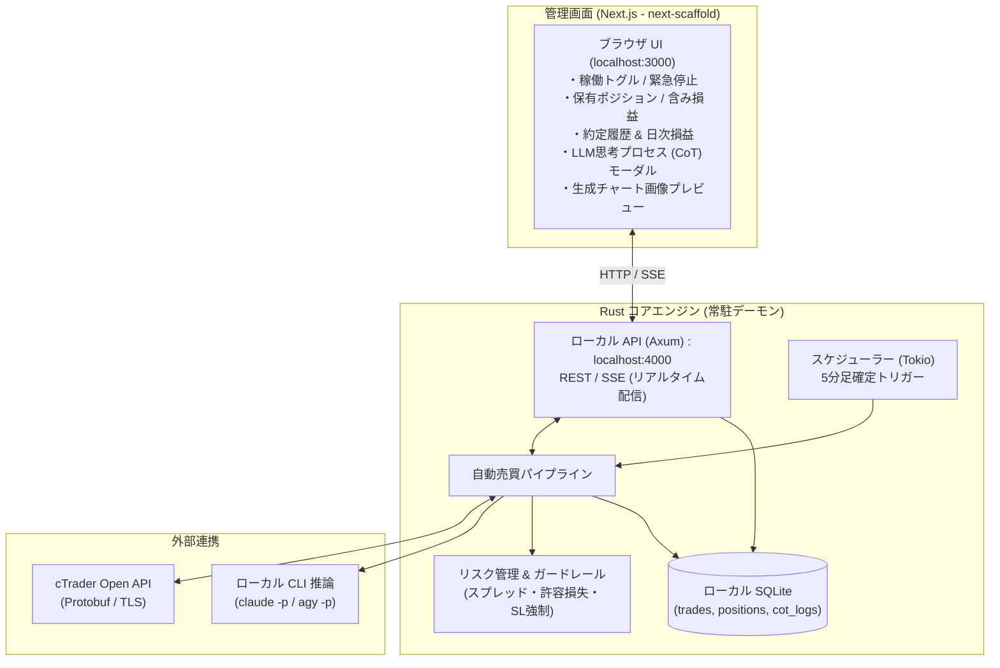

# 01. システム全体アーキテクチャ

## 1. 全体像

本システムは、ローカル環境で完結する自動売買システムです。
外部クラウドへのSaaSデプロイは行わず、手元のマシンで常駐する **Rustコアエンジン** と、ローカルブラウザから操作・監視する **Next.js管理画面（next-scaffoldベース）** で構成されます。



---

## 2. 管理画面（Next.js / next-scaffold）の設計

プロジェクト内の `dashboard/`（または `web/`）に配置し、`bee8` プロジェクトの `next-scaffold` をベースに構築します。

### 主な画面・UI機能
1. **ダッシュボード概要 (`DashboardLayout`)**:
   - **稼働状態コントロール**: ボットの稼働/一時停止/緊急停止（Circuit Breaker）のワンクリック切り替えスイッチ。
   - **サマリーメトリクス (`Card`)**: 口座残高、本日の確定損益、保有含み損益、本日の勝率、現在スプレッド。
2. **ポジション一覧 (`Table`, `Badge`)**:
   - 通貨ペア、売買方向（BUY: 緑, SELL: 赤）、ロット数、エントリー価格、現在価格、SL/TP価格、損益pips。
   - 手動決済ボタン（緊急時の手動イグジット）。
3. **LLM思考プロセス（CoT）履歴ビューア (`Dialog`, `Sheet`)**:
   - **最重要機能**: 「なぜその判断（BUY/SELL/HOLD）を下したのか」を一覧から選択し、詳細モーダルで確認。
   - 確信度、検出プライスアクション、根拠となった上位足・下位足の状況、シナリオ無効化価格（SLの理由）。
4. **チャートプレビュー**:
   - 直近の推論時に `plotters` で自動生成された4分割（4H/1H/15M/5M）のローソク足チャート画像を表示。
5. **教訓（Lessons Learned）マネージャー**:
   - 損切り後に自動蓄積された「失敗の教訓リスト」を閲覧・編集・無効化できる設定画面。

---

## 3. Rust コアエンジンの設計

Rust 1.98（Tokio非同期ランタイム）を採用し、常駐デーモンとして24時間安定稼働します。

### 主要モジュール
- **`market_data`**: cTrader Open APIとProtobuf通信を行い、リアルタイムTickおよび5M/15M/1H/4HのTrendbarsを取得・メモリキャッシュ。
- **`chart_plotter`**: `plotters` クレートを用い、プライスアクション専用のマルチタイムフレーム合成PNG画像を生成。
- **`llm_client`**: `tokio::process::Command` を用いてローカルの `claude -p` や `agy -p` をサブプロセスとして実行し、標準入出力経由で推論JSONを取得。
- **`risk_manager`**: スプレッド拡大チェック、1日最大許容損失、SL必須チェック、ロット数自動計算。
- **`order_executor`**: cTrader Open APIへサーバーサイドSL/TP付きの注文を発注。
- **`server`**: `axum` による軽量HTTPサーバー。Next.js管理画面に対してREST APIおよびSSE（Server-Sent Events）を提供。
- **`storage`**: `sqlx` / `rusqlite` によるSQLite永続化。

---

## 4. ローカルCLI（`claude -p` / `agy -p`）との連携設計

SaaS APIキーを直接埋め込むのではなく、ローカルに導入済みのCLIツールをサブプロセス経由でパイプ連携させます。

### 連携コードイメージ (Rust)
```rust
use tokio::process::Command;
use std::process::Stdio;
use tokio::io::AsyncWriteExt;

pub async fn run_llm_inference(prompt: &str, cli_name: &str) -> Result<String, Box<dyn std::error::Error>> {
    let mut child = Command::new(cli_name)
        .arg("-p")
        .stdin(Stdio::piped())
        .stdout(Stdio::piped())
        .spawn()?;

    if let Some(mut stdin) = child.stdin.take() {
        stdin.write_all(prompt.as_bytes()).await?;
    }

    let output = child.wait_with_output().await?;
    let stdout = String::from_utf8(output.stdout)?;
    Ok(stdout)
}
```

- 出力からMarkdownのコードブロック（```json ... ```）を抽出し、`serde_json` で型安全な構造体にデシリアライズ。
- タイムアウト（例: 30秒）またはパース失敗時は安全側に倒して **`HOLD（見送り）`** を採用。

---

## 5. 安全設計（ガードレール）

- **サーバーサイドSLの強制**: 新規発注時に必ずSL価格をブローカー側に送信（PCの電源断やクラッシュ時にもブローカー側で損切りが執行される）。
- **サーキットブレーカー**: 1日の累積損失が資金のX%（例: 3%）に達した場合、以降の全新規発注をその日は物理的に遮断。
- **スプレッドフィルタ**: 経済指標発表時や深夜早朝など、スプレッドが一定以上拡大している場合は注文を破棄。
