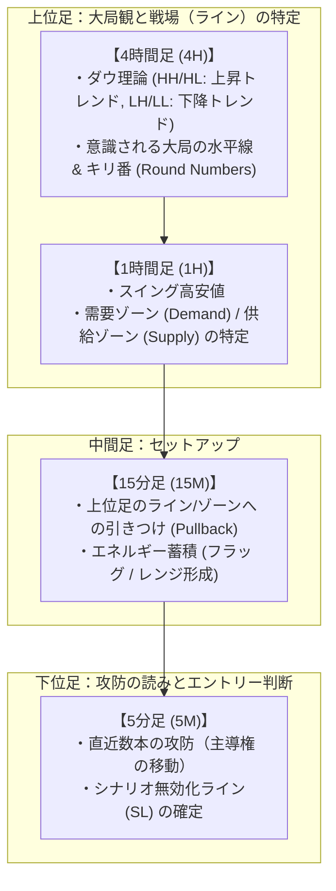

# 02. プライスアクション特化型 取引戦略 & プロンプト設計

## 1. 取引哲学：なぜプライスアクションなのか？

従来のテクニカル指標（RSI, MACD, 移動平均線乖離等）は、すべて過去価格から計算された**遅行指標（Lagging Indicator）**です。
一方、ローソク足の形状・ヒゲ・実体サイズ・レジサポでの反発は、**「今まさにその瞬間、買い手と売り手のどちらが主導権を握っているか（注文の攻防）」の直接的な痕跡**です。

### プライスアクション × LLM の相乗効果
1. **文脈を読む力（画像）**:
   - 「押し目を作っている最中か、天井圏か」「ブレイクを試みて拒絶されたか」といった、ルール化しにくい相場の攻防をチャートの形から読み取れます。定量ルールで書けることはLLMに任せる必要がなく、**書けないことをやらせるためにLLMを使います**。
2. **数値の精度（生OHLC）**:
   - 画像は正確な価格を読むのに向かないため、下位足の生OHLCを併せて渡し、SLや無効化ラインの数値精度を担保します。
3. **損切りライン（無効化価格）の客観性**:
   - 「この価格を実体で抜けたら相場観が間違い」とLLM自身に言語化させることで、損切りが「なんとなく」ではなく検証可能な仮説になります。

---

## 2. 対象通貨ペアと優先度

1. **USD/JPY (最優先)**:
   - スプレッドが極小（0.1〜0.3 pips程度）。水平線やキリ番（150.00, 150.50等）でのプライスアクションが極めて素直に機能。
2. **EUR/USD (最優先)**:
   - 世界最大の出来高。ダウ理論によるトレンド継続・転換のプライスアクションが教科書通りに現れやすい。
3. **XAU/USD (ゴールド・優先度低)**:
   - ボラティリティが激しくヒゲが長いため、USD/JPY・EUR/USDでシステムの精度を確認した後に調整。

---

## 3. マルチタイムフレーム（MTF）× プライスアクション構造

5分足単体の形状だけでは「騙し」に遭うため、上位足の環境認識と下位足の攻防の読みを連動させます。以下は LLM に読ませる視点の整理であり、プログラムが判定する項目ではありません。



---

## 4. 役割分担の原則：プログラムは「事実」、LLMは「解釈」

### 4.1 なぜ判定ロジックをプログラムから外すのか

初期設計では、プログラム側で「ピンバーである」「包み足である」「4Hは上昇トレンドである」「キーレベルにいる」を幾何学的に判定し、そのラベルをLLMに渡していました。
この構成では、**エントリー可能状態の検知がそのままエントリーロジックになり、LLMは判定結果を書き写すだけの存在**になります。定量ルールで勝てるならLLMは不要であり、LLMを使う理由が消えます。

したがって役割を次のように固定します。

| 担当 | やること | やらないこと |
| :--- | :--- | :--- |
| **プログラム** | 客観的事実の収集・整形（画像、生OHLC、数値）<br>LLM出力の**事後ガード**（リスク管理）<br>LLMが出した**条件付きプランの監視と執行** | パターン判定、トレンド判定、サポレジ判定、方向のラベル付け |
| **LLM** | 環境認識、注文の攻防の解釈、シナリオ構築、無効化ラインの決定、エントリー/見送りの判断 | 口座リスクの管理、発注そのもの |

### 4.2 「判定」と「事実」の線引き

同じ計算でも、**解釈を含むもの**は渡さず、**再現可能な測定値**だけを渡します。

| 渡す（事実） | 渡さない（判定） |
| :--- | :--- |
| スイング高値・安値の価格と時刻のリスト | `"4H_trend": "BULLISH"` のようなラベル |
| 直近N本のOHLC | `"type": "PINBAR"`, `"pattern_detected"` |
| ATR、当日レンジ、前日高安、セッション高安 | `"at_key_level": "TESTING_H4_SUPPORT"` |
| キリ番の価格リスト | `nearest_support` / `nearest_resistance`（何が支持かは解釈） |
| EMA20/50の現在値（描画にも使う） | EMAとの位置関係のラベル（`PULLBACK_TO_EMA20`など） |

### 4.3 3大パターンの扱い

ピンバー、包み足、フェイクアウト（流動性ハント）は引き続き重要な**知識**ですが、**ゲート条件ではなくなります**。
プロンプトには「こうした形は買い手・売り手の攻防の痕跡として読める」という参考知識として記述し、「この形が無ければHOLD」という縛りは置きません。パターンが無くても攻防の読みから入れる場面、パターンがあっても見送るべき場面の両方をLLMに判断させます。

---

## 5. インプット設計（画像 + 生OHLC + 客観数値）

画像とテキストは役割が違うため両方を渡します。画像は「形と文脈」、数値は「精度」を担います。

| 時間足 | 画像 | 生OHLC | 目的 |
| :--- | :---: | :---: | :--- |
| 4H | ○ | × | 大局観。どちらの勢力が優勢か、押し目形成中か天井圏か |
| 1H | ○ | × | スイング構造、直近の攻防の場所 |
| 15M | ○ | 直近30本 | セットアップの形と、スイング価格の精度 |
| 5M | ○ | 直近30本 | 直近数本の攻防を1本ずつ読む。SL/無効化ラインの数値精度 |

上位足のOHLCまでテキストで渡すと情報量だけ増えて読解が薄くなるため、上位足は画像のみとします。

### A. チャート画像の描画仕様

- **時間足ごとに1枚ずつ、計4枚**を生成します。4分割1枚では1パネルあたりの解像度が不足し、5M足のヒゲや実体が潰れます。
- 推奨サイズは1枚あたり 1200×800 前後。CLIのReadツールは大きな画像を縮小するため、1枚を巨大にしても細部は届きません。
- **描画するもの（事実のみ）**:
  1. ローソク足
  2. EMA 20 / EMA 50（薄い線。ラベルは「EMA 20」「EMA 50」のみ）
  3. 水平線: 前日高値・安値、当日高値・安値、スイング高値・安値、キリ番。**線には価格だけを添え、「支持」「抵抗」の語は書かない**
  4. 現在価格の点線
- **描画しないもの（判定）**: パターン名のタイトル表示、トリガー足の強調枠、方向を示唆する色分け。
- 画像に引いた水平線の価格は、テキスト側の数値リストと**同じ値にします**。LLMが画像とテキストを突き合わせて推論できるようにするためです。

### B. 構造化テキスト（客観的事実）

```json
{
  "pair": "USDJPY",
  "timestamp": "2026-09-14 07:35:00 UTC",
  "session": "TOKYO",
  "current_price": 154.213,
  "spread_pips": 0.3,
  "volatility": {
    "atr14_5m_pips": 4.1,
    "atr14_15m_pips": 7.8,
    "atr14_1h_pips": 18.5,
    "atr14_4h_pips": 42.0,
    "today_range_pips": 31.0,
    "today_range_vs_20d_avg": 0.62
  },
  "reference_levels": {
    "prev_day_high": 154.680,
    "prev_day_low": 153.720,
    "today_high": 154.410,
    "today_low": 154.100,
    "asia_session_high": 154.410,
    "asia_session_low": 154.100,
    "round_numbers": [153.500, 154.000, 154.500, 155.000],
    "ema_1h": { "ema20": 154.180, "ema50": 153.950 },
    "ema_4h": { "ema20": 153.820, "ema50": 153.410 }
  },
  "swing_points": {
    "4h": [
      { "time": "2026-09-11 08:00", "type": "high", "price": 154.950 },
      { "time": "2026-09-12 16:00", "type": "low",  "price": 153.720 }
    ],
    "1h": [ "..." ],
    "15m": [ "..." ]
  },
  "bars_15m": [
    { "t": "07:00", "o": 154.240, "h": 154.290, "l": 154.180, "c": 154.200 },
    "... 直近30本 ..."
  ],
  "bars_5m": [
    { "t": "07:30", "o": 154.200, "h": 154.240, "l": 154.080, "c": 154.220 },
    "... 直近30本 ..."
  ],
  "account_state": {
    "open_positions": [],
    "recent_decisions": [
      { "time": "07:30", "action": "HOLD", "summary": "154.10の攻防待ち" }
    ]
  }
}
```

- `session` は時刻から機械的に決まる事実（TOKYO / LONDON / NY / OFF）です。
- `today_range_vs_20d_avg` のような**記述統計**は過去データから機械的に出せる事実であり、判定ではありません。「今日は普段の6割しか動いていない」という文脈を与えます。
- `recent_decisions` を渡すのは、5分ごとに判断が反転する「フリップフロップ」を防ぎ、前回立てたシナリオとの整合をLLM自身に取らせるためです。
- **欠損時に値を捏造しない**。スイングが見つからなければ空配列を渡し、「現在価格±50pips」のような代替値は入れません。

---

## 6. プロンプト指示 & 出力フォーマット

### システムプロンプト骨子

```markdown
あなたはプライスアクションとマルチタイムフレーム分析を専門とするプロFXトレーダーです。
添付の4枚のチャート画像（4H / 1H / 15M / 5M）と、客観的事実のJSONを読み、以下の順序で相場の攻防を読み解いてください。

【1. 環境認識（4H / 1H）】
- 現在どちらの勢力が優勢か。押し目・戻りを作っている最中か、天井圏・底値圏か、方向感の無いレンジか。
- 直近で買い手・売り手が明確に戦った価格帯はどこか。

【2. 注文の攻防（15M / 5M）】
- 直近数本のローソク足から、どちらが主導権を握り直したか。
- ブレイクを試みて拒絶された兆候、あるいは受け入れられた兆候はあるか。
- 上位足の文脈とこの攻防は整合しているか、矛盾しているか。

【3. シナリオと無効化ライン】
- エントリーするなら、どこを抜けたらこの相場観は完全に間違いになるか（＝損切り）。
- 今は入らないが、何が起きたら入るか（条件付きプラン）。

【判断の姿勢】
- 上位足に逆行する場合は、逆行する明確な根拠を言語化できる場合のみ許容する。
- 形だけのパターン一致ではなく、「なぜそこで買い手/売り手が動いたか」を説明できない場合は見送る。
- 自信が無い場合は HOLD とし、待ち条件を提示する。HOLD は失敗ではない。
```

ピンバー・包み足・フェイクアウトの説明は「攻防の痕跡の読み方」として参考知識セクションに置き、必須条件にはしません。
リスクリワード下限、確信度閾値、スプレッド上限などの**数値ルールはプロンプトに書かず、プログラム側の事後ガードで扱います**（プロンプトに書くとLLMがルールを満たすように数値を後付けで調整する誘因になるため）。

### LLM出力スキーマ（JSON）

```json
{
  "action": "BUY | SELL | HOLD",
  "confidence": 0.7,
  "entry_type": "MARKET | LIMIT | CONDITIONAL",
  "entry_price": 154.215,
  "stop_loss": 154.070,
  "take_profit": 154.520,
  "analysis": {
    "macro_context": "4Hは9/12安値153.72から切り上げ継続。1HはEMA20付近まで押しを作り、154.10で2度下げ止まり。",
    "order_flow": "5M直近3本で154.10割れを試したが2本連続で長い下ヒゲ。売り手のブレイク試行が拒絶され、直近2本は買い手が実体を積み上げている。",
    "invalidation": "154.07（直近5M安値の外側）。ここを実体で割れば買い手の防衛が失敗した証拠であり、シナリオは無効。",
    "conflicts": "当日レンジが平均の6割で、ロンドン前の低ボラ。ブレイクの勢いは弱い可能性。"
  },
  "conditional_plan": {
    "wait_for": "5Mが154.24（直近高値）を実体で上抜けて確定",
    "then_action": "BUY",
    "invalidate_if": "154.07を実体で下抜け",
    "expires_at": "2026-09-14 08:30:00 UTC"
  },
  "observed": {
    "latest_bar_4h": "2026-09-14 04:00",
    "latest_bar_1h": "2026-09-14 07:00",
    "latest_bar_15m": "2026-09-14 07:30",
    "latest_bar_5m": "2026-09-14 07:30"
  },
  "reasoning": "上位足の押し目と5Mの下げ止まりが整合。ただしブレイクの勢いが弱いため成行では入らず、直近高値の実体抜けを待つ。"
}
```

- `conditional_plan` は「今は入らないが条件が揃えば入る」を表現します。プログラムはこの条件を5M確定ごとに機械的に評価し、成立すれば**LLMを再度呼ばずに**発注します（事後ガードは通します）。
- `observed` は各画像で確認した最新足の時刻です。プログラム側が実際の最新足と突き合わせ、不一致なら「画像を読まずに答えた」とみなして判断を破棄します。
- `conflicts` はシナリオに反する材料を必ず1つ以上書かせます。片側の根拠だけを並べる出力を防ぐためです。

---

## 7. 事後ガード（プログラム側の機械的検証）

LLMの出力は、発注前に以下を**全て**通過する必要があります。1つでも失敗すればHOLDに倒します。ここは判断ではなくリスク管理なので、数値は設定ファイル（`config/guard.toml`）で固定します。実装は `src/guard`。

| ガード | 内容 | 初期値 |
| :--- | :--- | :--- |
| スキーマ検証 | JSONが型通りか、BUY/SELL時にSLが必ず設定されているか | — |
| 観測整合 | `observed` の各時刻が実際の最新足と一致するか | 完全一致 |
| SL方向 | BUYならSL<entry、SELLならSL>entry | — |
| SL幅 | ATR(5M)の何倍以内か、最小何pips以上か | 0.5〜4.0 ATR, 最小3pips |
| リスクリワード | (TP−entry)/(entry−SL) が下限以上か | 1.5 |
| 確信度 | リプレイ環境で較正した閾値以上か | 較正前は0.70 |
| スプレッド | 現在スプレッドが上限以内か | 1.0 pips (USDJPY) |
| 指標ブラックアウト | 高重要度指標の前後N分でないか | 前30分・後15分 |
| ポジション上限 | 同一ペア・全体の同時保有数 | 各1 |
| 日次損失 | 当日累積損失が上限未満か（サーキットブレーカー） | 資金の3% |
| 条件付きプラン期限 | `expires_at` を過ぎていないか | — |

ガードで弾かれた場合も、LLMの出力とどのガードに抵触したかを **CoTログに必ず保存**します。ガードの妥当性そのものをリプレイで検証するためです。
