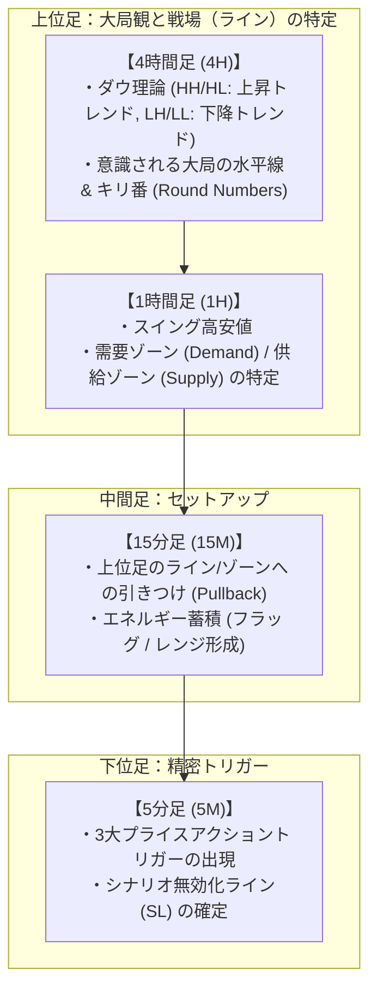

# 02. プライスアクション特化型 取引戦略 & プロンプト設計

## 1. 取引哲学：なぜプライスアクションなのか？

従来のテクニカル指標（RSI, MACD, 移動平均線乖離等）は、すべて過去価格から計算された**遅行指標（Lagging Indicator）**です。
一方、ローソク足の形状・ヒゲ・実体サイズ・レジサポでの反発は、**「今まさにその瞬間、買い手と売り手のどちらが主導権を握っているか（注文の攻防）」の直接的な痕跡**です。

### プライスアクション × LLM の相乗効果
1. **マルチモーダル（画像認識）の真価**:
   - LLM（Claude / Gemini等）は、「長い下ヒゲによる反発」「包み足」「ダブルトップのネックライン抜け」といった視覚的パターンの認識が極めて高精度です。
2. **損切りライン（無効化価格）の客観性**:
   - 「ピンバーの下ヒゲ先端を割ったらシナリオ崩壊」「ブレイク足の安値を割ったら撤退」と明確に定義できるため、損切り幅がタイトになり、リスクリワード比（1:1.5〜1:3以上）が飛躍的に向上します。

---

## 2. 対象通貨ペアと優先度

1. **USD/JPY (最優先)**:
   - スプレッドが極小（0.1〜0.3 pips程度）。水平線やキリ番（150.00, 150.50等）でのプライスアクションが極めて素直に機能。
2. **EUR/USD (最優先)**:
   - 世界最大の出来高。ダウ理論によるトレンド継続・転換のプライスアクションが教科書通りに現れやすい。
3. **XAU/USD (ゴールド・優先度低)**:
   - ボラティリティが激しくヒゲが長いため、USD/JPY・EUR/USDでシステムの精度を確認した後に調整。

---

## 3. マルチタイムフレーム（MTF）× プライスアクション構造

5分足単体の形状だけでは「騙し」に遭うため、上位足の環境認識と下位足のトリガーを完全に連動させます。



---

## 4. 5分足（5M）で狙う3大エントリートグル

LLMには以下の3つの高勝率パターンに絞ってエントリーを判断させます。

```
[パターン1: ピンバー]      [パターン2: 包み足]       [パターン3: フェイクアウト]
      |                        |  ┌──┐                  ───┬─── 直近高値ライン
      |                        └──┤  │                     │
    ┌─┴─┐                         │  │                   ┌─┴─┐  一瞬上抜けて損切りを狩り、
    └───┘                         │  │                   └───┘  すぐに陰線で戻す
      |                           └──┘                     │
(サポレジで強く拒絶)       (前の足を完全に飲み込む)     (大衆の裏をかく急反転)
```

### ① レジェクション・ピンバー（Rejection Pin Bar）
- **特徴**: 上位足のサポート/レジスタンスラインに突っ込んだ後、長いヒゲを残して押し戻された形状。
- **成立条件**:
  - ヒゲの長さがローソク足全体の**60%以上**を占める。
  - 実体がラインの内側に収まって引けている（ライン突破が拒絶された）。
- **SL位置**: ヒゲの先端の外側 + 1〜2 pips。

### ② インガルフィング / 包み足（Bullish / Bearish Engulfing）
- **特徴**: 直前の調整足（逆方向の足）を、実体ベースで完全に包み込む勢いのある大陽線/大陰線。
- **成立条件**:
  - 15Mで押し目/戻り目を形成した後、トレンド方向への力強い推進波が発生したサイン。
- **SL位置**: 包み足の安値（買いの場合）または高値（売りの場合）の外側。

### ③ フェイクアウト / 流動性ハント（False Breakout / Liquidity Grab）
- **特徴**: 直近の目立つ高値/安値を一瞬だけブレイクし、大衆のブレイク買いやストップロスを巻き込んだ直後に、急激に逆方向へ反転するパターン。
- **成立条件**:
  - ブレイクした足がヒゲとなって確定するか、次足で即座にレンジ内へ大陰線/大陽線で回帰する。
  - **最も優位性とリスクリワード比が高いセットアップ**。
- **SL位置**: 騙しとなったヒゲの最高値/最安値の外側。

---

## 5. インプット設計（画像 & テキスト）

### A. チャート画像（マルチモーダル）の描画仕様
インジケーターで画面を埋め尽くさず、**プライスアクションを視覚化するためのクリーンなチャート**を生成します。

- **レイアウト**: 4分割（左上: 4H, 右上: 1H, 左下: 15M, 右下: 5M）
- **描画要素**:
  1. ローソク足（視認性の高い配色）
  2. EMA 20 & EMA 50（ダイナミックなサポレジとしてのみ機能）
  3. 自動検出された直近スイング高値・安値の水平ライン（直近の抵抗帯・支持帯）
  4. 5分足の直近5〜10本のフォーカス

### B. 構造化テキスト（プライスアクション特徴量）
画像だけでなく、プログラム側で算出したローソク足の幾何学的特徴をJSONで渡します。

```json
{
  "pair": "USDJPY",
  "timestamp": "2026-09-14 07:35:00",
  "spread_pips": 0.3,
  "market_structure": {
    "4H_trend": "BULLISH (Higher Highs / Higher Lows)",
    "nearest_h4_resistance": 155.00,
    "nearest_h4_support": 153.80,
    "1H_trend": "BULLISH_PULLBACK_TO_EMA20"
  },
  "5M_price_action": {
    "current_bar": {
      "type": "PINBAR",
      "direction": "BULLISH",
      "total_range_pips": 8.2,
      "lower_wick_ratio": 0.68,
      "body_ratio": 0.22,
      "rejection_level": 154.12
    },
    "pattern_detected": "SUPPORT_REJECTION_PINBAR",
    "at_key_level": "TESTING_15M_PREVIOUS_RESISTANCE_TURNED_SUPPORT"
  }
}
```

---

## 6. プロンプト指示 & 出力フォーマット

### システムプロンプト骨子
```markdown
あなたはプライスアクションとマルチタイムフレーム分析を専門とするプロFXトレーダーです。
インジケーターの数値の過度な盲信を避け、「ローソク足の形状」「サポレジラインでの拒絶（Rejection）」「市場の流動性（騙しブレイク）」を最重要視して判断してください。

【厳格なエントリー条件】
1. 4H・1Hの上位足トレンドに逆行するエントリーは原則禁止。
2. 5M足で明確なトリガー（ピンバー、包み足、フェイクアウト）が発生していない場合は必ず「HOLD（見送り）」とすること。
3. ストップロス（SL）は必ず「プライスアクションの根拠が崩れる明確なライン（ヒゲの先端など）」に設定すること。
4. 想定リスクリワード比（SL幅とTP幅の比率）が最低 1 : 1.5 未満の場合は見送ること。
```

### LLM出力スキーマ（JSON）
```json
{
  "action": "BUY | SELL | HOLD",
  "confidence": 0.88,
  "entry_type": "MARKET",
  "entry_price": 154.20,
  "stop_loss": 154.08,
  "take_profit": 154.50,
  "risk_reward_ratio": 2.5,
  "price_action_analysis": {
    "macro_bias": "4Hダウ理論上昇継続。1HはEMA20まで押し目を形成。",
    "trigger_pattern": "5M足にて154.12の支持帯で下ヒゲ68%の明確なレジェクション・ピンバー確定。",
    "invalidation_point": "154.08（ピンバーの安値）。ここを下抜けた場合は買いシナリオが即時崩壊するため損切り。"
  },
  "reasoning": "上位足の押し目ゾーンと合致したプライスアクショントリガー。リスク幅12pipsに対して利確目標30pips（直近1H高値手前）を狙える良好なリスクリワード。"
}
```
