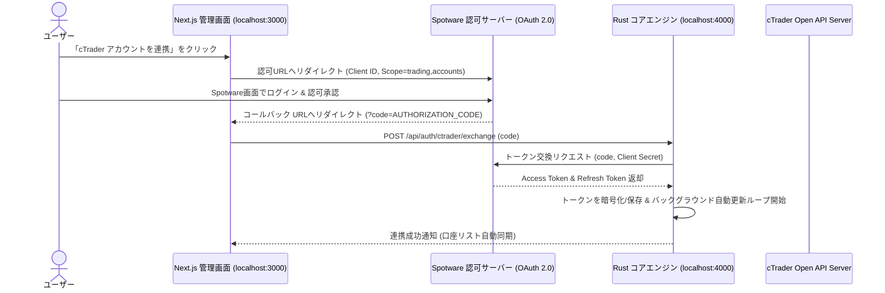
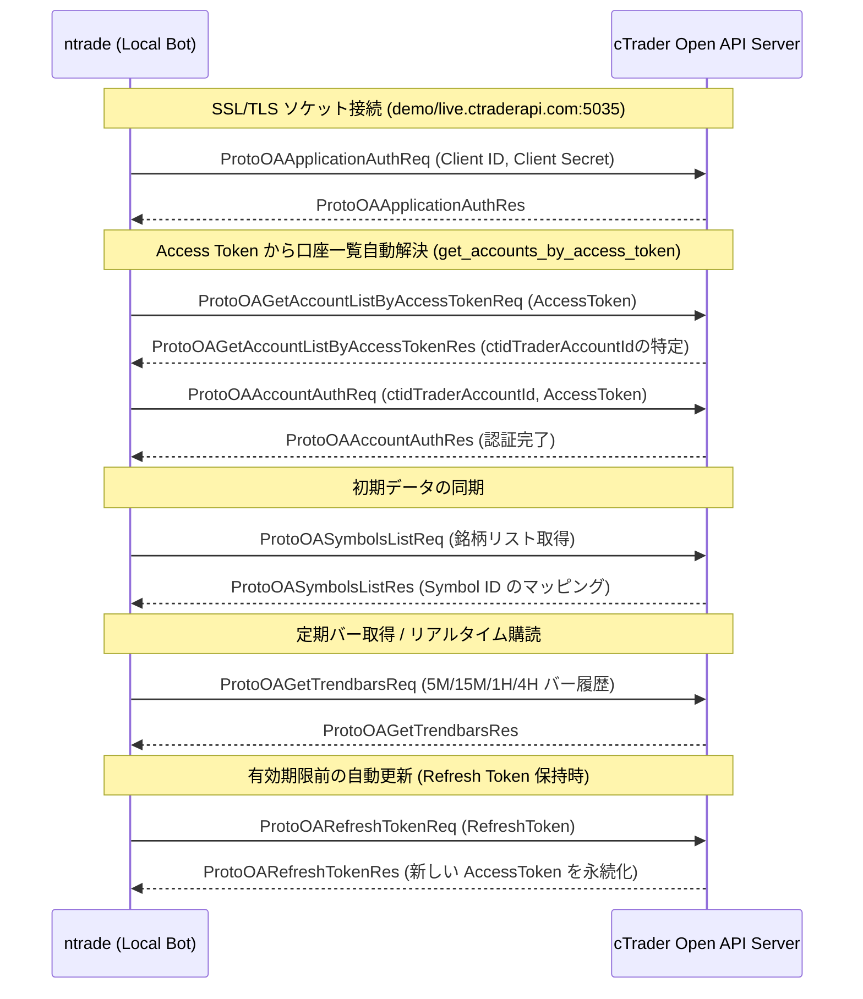

# 03. cTrader Open API 連携仕様

## 1. cTrader Open API の概要

cTrader Open API は、Spotware社が提供する高機能トレーディングAPIです。
多くの海外FX業者（Axiory, Tradeview, Pepperstone等）でサポートされており、以下の特徴があります。

- **プロトコル**: Protocol Buffers (Protobuf) over SSL/TLS（TCP または WebSocket）
- **高速性**: FIX APIに匹敵する低レイテンシと高い信頼性
- **認証**: OAuth 2.0 ベース（Client ID, Client Secret, Access Token, cTrader ID）

---

### 2.1 アプリ内 OAuth 2.0 連携フロー (Step 5 実装予定)
手動での Access Token / Refresh Token コピーを完全撤廃し、管理画面からワンクリックで認証・自動更新を行うアーキテクチャです。



### 2.2 ソケット接続 & 取引口座認証フロー



---

## 3. 主要なAPIメッセージ仕様

| メッセージ名 | 用途 | 備考 |
| :--- | :--- | :--- |
| `ProtoOAApplicationAuthReq` | アプリケーション認証 | Client ID, Client Secretを送信 |
| `ProtoOAAccountAuthReq` | 取引口座認証 | Account ID (ctidTraderAccountId) と Access Token を送信 |
| `ProtoOASymbolsListReq` | 通貨ペアシンボルID取得 | "USDJPY", "EURUSD" の内部シンボルIDを解決 |
| `ProtoOAGetTrendbarsReq` | 過去ローソク足データ取得 | 指定期間・時間足（M5, M15, H1, H4）のOHLCVを取得 |
| `ProtoOASubscribeSpotsReq` | リアルタイムTick購読 | 現在のスプレッド、Bid/Askのリアルタイム更新を受信 |
| `ProtoOANewOrderReq` | 新規注文（成行/指値） | ロット数、注文種別、SL/TP価格を指定して発注 |
| `ProtoOAClosePositionReq` | ポジション手動決済 | 保有ポジションの全部/一部を成行決済 |
| `ProtoOAExecutionEvent` | 約定通知イベント (受信) | 新規約定、SL/TP到達による決済、注文拒否などの通知 |

---

## 4. 注文パラメータと安全設計

### ロット数計算
固定ロット（例: 0.1 lot）ではなく、**「口座資金のX%（例: 1%）の最大損失許容額」÷「SL幅（pips）」**から動的にロット数を算出するリスク管理モデルを標準とします。

$$\text{ロット数} = \frac{\text{口座資金} \times \text{リスク率 (例: 0.01)}}{\text{SL幅 (pips)} \times 1\text{pipあたりの価値}}$$

### SL/TP（ストップロス・テイクプロフィット）の扱い
- 新規注文時（`ProtoOANewOrderReq`）に、最初からSL/TPを付与してサーバーサイドに送信します。
- これにより、万が一本システム（ローカルPC）のクラッシュや、停電・回線切断が発生しても、ブローカーサーバー側で確実に逆指値が執行されます。

---

## 5. 切断耐性と運用監視

1. **Heartbeat (ProtoPingReq / ProtoPingRes)**:
   - 10秒〜25秒おきにHeartbeatパケットを送信し、ソケットの生存を確認します。
2. **自動再接続**:
   - 回線切断を検知した場合、Exponential Backoff（指数関数的待機）で再接続と再認証を自動実行。
3. **環境変数での認証情報管理 (`.env`)**:
   ```ini
   CTRADER_CLIENT_ID="your_client_id"
   CTRADER_CLIENT_SECRET="your_client_secret"
   CTRADER_ACCOUNT_ID="your_account_id"
   CTRADER_ACCESS_TOKEN="your_access_token"
   CTRADER_ENV="DEMO" # DEMO or LIVE
   ```
   - ソースコード内にキーをハードコードせず、`.gitignore` で確実に除外。

---

## 6. FIX API（発注経路の代替）

### 6.1 なぜ必要か

cTrader Open API の利用可否は**ブローカーごとに設定できる**。口座の `accessRights` が
`FULL_ACCESS`、シンボルの `tradingMode` が `ENABLED`、アクセストークンの scope が `trading`
であっても、ブローカーが API 取引を無効化していると新規注文に `TRADING_DISABLED`
（"Trading is disabled"）が返る。

実測（2026-09-21・同一アプリ / 同一アクセストークン / 同一コード）:

| 口座 | 発注 |
|---|---|
| AXIORY デモ #8069118 | `TRADING_DISABLED` |
| Spotware デモ #5914722 | 約定成功 |

この場合の発注手段が FIX API になる。

### 6.2 ハイブリッド構成

FIX API には公式に以下の制限がある。

1. ヒストリカルデータを取得できない
2. 口座情報（残高・レバレッジ・証拠金）を取得できない

ntrade は Snapshot のチャート生成に 5M/15M/1H/4H の履歴を、リスク計算に残高を使うため、
FIX 単独では成立しない。一方、API 取引が無効な口座でも**データ取得と口座情報の参照は
Open API で正常に動く**（拒否されるのは取引操作のみ）。したがって構成は次のように分ける。

| 用途 | 経路 |
|---|---|
| バーデータ・シンボル・口座情報・ポジション照合 | Open API |
| 新規発注・決済・SL/TP | FIX API |

`CTRADER_FIX_HOST` が設定されている場合のみ FIX を使い、未設定なら従来どおり
Open API で発注する（`AppState::build_order_sink`）。FIX の接続に失敗した場合も
Open API 発注にフォールバックする。

### 6.3 SL/TP の扱いが Open API と異なる

FIX の `NewOrderSingle(35=D)` には **SL/TP を添付できない**。`AbsoluteSL`(1002) /
`RelativeSL`(1003) などのタグは `ExecutionReport` と `PositionReport` 側にしか定義が無い。
そのため約定後に、反対サイドの Stop 注文（SL）と Limit 注文（TP）を保護注文として張る。

**ネッティング口座では、建玉が無い状態で保護注文が発動すると決済ではなく新規の逆建玉が立つ。**
したがって以下の3点は省略できない。

1. **OCO 管理** — 片方が約定したらもう片方を取り消す（`fix::trading` の OCO 監視タスク）
2. **決済時の取り消し** — `AppState::close_broker_position` が決済前に取り消す
3. **手動決済の検出** — reconcile でブローカー側から建玉が消えたら取り消す（`scheduler::after_cycle`）

また、保護注文の発注に失敗した場合は、SL の無い建玉を残さないよう**ポジションを成行で決済**してから
エラーを返す（`FixOrderSink::place_market`）。

### 6.4 セッション仕様

| 項目 | 値 |
|---|---|
| FIX バージョン | 4.4 |
| TargetCompID(56) | `CSERVER` |
| TargetSubID(57) | `TRADE`（価格用の `QUOTE` セッションは使わない） |
| SenderCompID(49) | `<環境>.<BrokerUID>.<ログイン番号>` 例: `demo.axiory.8069118` |
| Username(553) | 数値のログイン番号 |
| ポート | SSL 5212 / 平文 5202 |
| シーケンス番号 | セッション確立ごとにリセット（Logon で `ResetSeqNumFlag=Y`） |
| OrderQty(38) | **units**（0.01 lot = 1,000）。Open API の cents とは異なる |

認証情報は cTrader デスクトップ/Web 版の「設定 → FIX API」から取得する。

### 6.5 検証

```bash
make fix            # 接続と Logon のみ
make fix ORDER=1    # 0.01 lot の成行 + SL/TP を張って即決済
```
