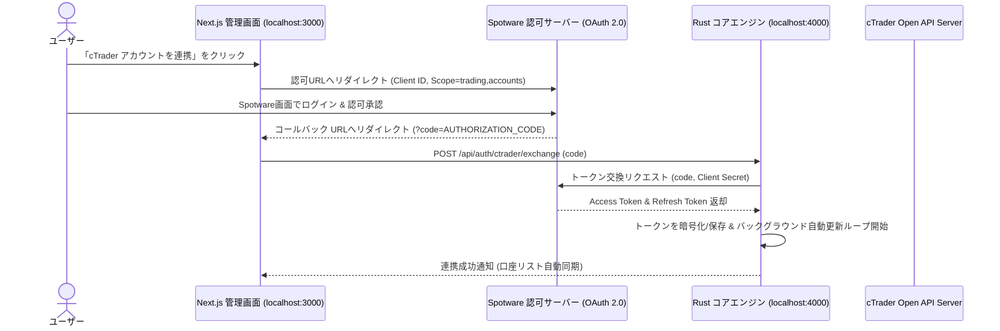
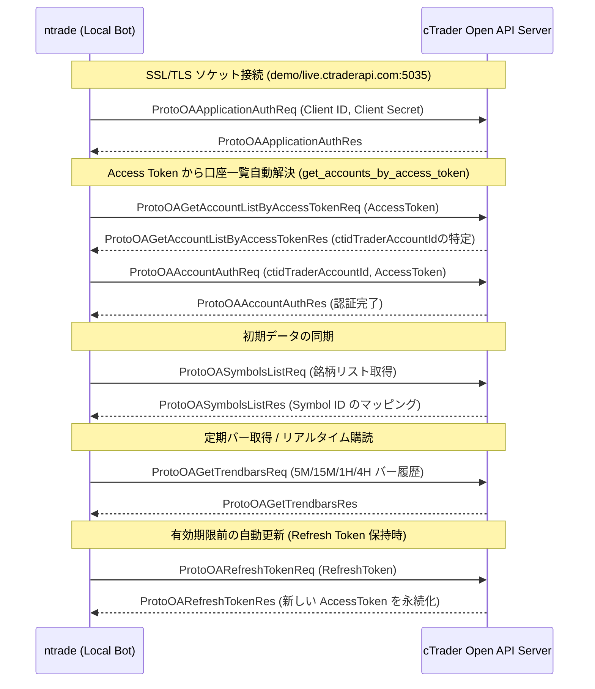

# 03. cTrader Open API 連携仕様

## 1. cTrader Open API の概要

cTrader Open API は、Spotware社が提供する高機能トレーディングAPIです。
多くの海外FX業者（Axiory, Tradeview, Pepperstone等）でサポートされており、以下の特徴があります。

- **プロトコル**: Protocol Buffers (Protobuf) over SSL/TLS（TCP または WebSocket）
- **高速性**: FIX APIに匹敵する低レイテンシと高い信頼性
- **認証**: OAuth 2.0 ベース（Client ID, Client Secret, Access Token, cTrader ID）

---

### 2.1 アプリ内 OAuth 2.0 連携フロー (Step 5 実装予定)
手動での Access Token / Refresh Token コピーを完全撤廃し、管理画面からワンクリックで認証・自動更新を行うアーキテクチャです。



### 2.2 ソケット接続 & 取引口座認証フロー



---

## 3. 主要なAPIメッセージ仕様

| メッセージ名 | 用途 | 備考 |
| :--- | :--- | :--- |
| `ProtoOAApplicationAuthReq` | アプリケーション認証 | Client ID, Client Secretを送信 |
| `ProtoOAAccountAuthReq` | 取引口座認証 | Account ID (ctidTraderAccountId) と Access Token を送信 |
| `ProtoOASymbolsListReq` | 通貨ペアシンボルID取得 | "USDJPY", "EURUSD" の内部シンボルIDを解決 |
| `ProtoOAGetTrendbarsReq` | 過去ローソク足データ取得 | 指定期間・時間足（M5, M15, H1, H4）のOHLCVを取得 |
| `ProtoOASubscribeSpotsReq` | リアルタイムTick購読 | 現在のスプレッド、Bid/Askのリアルタイム更新を受信 |
| `ProtoOANewOrderReq` | 新規注文（成行/指値） | ロット数、注文種別、SL/TP価格を指定して発注 |
| `ProtoOAClosePositionReq` | ポジション手動決済 | 保有ポジションの全部/一部を成行決済 |
| `ProtoOAExecutionEvent` | 約定通知イベント (受信) | 新規約定、SL/TP到達による決済、注文拒否などの通知 |

---

## 4. 注文パラメータと安全設計

### ロット数計算
固定ロット（例: 0.1 lot）ではなく、**「口座資金のX%（例: 1%）の最大損失許容額」÷「SL幅（pips）」**から動的にロット数を算出するリスク管理モデルを標準とします。

$$\text{ロット数} = \frac{\text{口座資金} \times \text{リスク率 (例: 0.01)}}{\text{SL幅 (pips)} \times 1\text{pipあたりの価値}}$$

### SL/TP（ストップロス・テイクプロフィット）の扱い
- 新規注文時（`ProtoOANewOrderReq`）に、最初からSL/TPを付与してサーバーサイドに送信します。
- これにより、万が一本システム（ローカルPC）がクラッシュや停電・回線切断しても、ブローカーサーバー側で確実に逆指値が執行されます。

---

## 5. 切断耐性と運用監視

1. **Heartbeat (ProtoPingReq / ProtoPingRes)**:
   - 10秒〜25秒おきにHeartbeatパケットを送信し、ソケットの生存を確認。
2. **自動再接続**:
   - 回線切断を検知した場合、Exponential Backoff（指数関数的待機）で再接続と再認証を自動実行。
3. **環境変数での認証情報管理 (`.env`)**:
   ```ini
   CTRADER_CLIENT_ID="your_client_id"
   CTRADER_CLIENT_SECRET="your_client_secret"
   CTRADER_ACCOUNT_ID="your_account_id"
   CTRADER_ACCESS_TOKEN="your_access_token"
   CTRADER_ENV="DEMO" # DEMO or LIVE
   ```
   - ソースコード内にキーをハードコードせず、`.gitignore` で確実に除外。
