# 04. ロードマップ & 確定技術スタック

## 1. 確定技術スタック

ユーザー環境（Rust 1.98 & Cargo完備）および堅牢な常駐運用、洗練されたUIの実現に向けて、以下の技術スタックを正式採用します。

```
[フロントエンド: 管理画面]
Next.js 16 (App Router) + React 19 + Tailwind CSS v4 + shadcn/ui
(bee8 プロジェクトの next-scaffold をベースに複製・構築)
       ↕ HTTP REST / SSE (localhost:4000)
[バックエンド: コアエンジン]
Rust 1.98 (Tokio 非同期ランタイム + Axum Webフレームワーク)
       ├── cTrader Open API (Protobuf / TLS ソケット通信)
       ├── チャート画像生成 (plotters クレート、時間足ごと1枚)
       ├── LLM推論 (ローカルCLI: claude -p + 画像Read + --json-schema)
       ├── リプレイ環境 (ヒストリカルバー → Snapshot再生 → 採点)
       └── 永続化 (SQLite: rusqlite / sqlx)
```

### なぜこのスタックなのか？
1. **Rustの堅牢性と安全性**:
   - 24時間常駐する金融取引ボットにおいて、型安全性・メモリ安全性・ランタイムエラー（クラッシュ）の排除は最重要要件。
   - `tokio` による非同期I/Oで、cTraderのHeartbeat（Ping/Pong）やリアルタイムTick受信を極めて安定して処理可能。
2. **純Rustでのチャート描画 (`plotters`)**:
   - Python環境を介さず、Rust単体でプライスアクション専用のマルチタイムフレームローソク足チャート（PNG）を高速生成可能。
3. **`next-scaffold` による洗練された管理画面**:
   - 金融UIに必須のダークモード、`DashboardLayout`（サイドバー＋ヘッダー）、shadcn/ui（Table, Card, Dialog等）が完成しており、UI構築コストを最小化。
   - LLMの思考プロセス（CoT）を視覚的に追跡できるUIを即座に実現。

---

## 2. 開発ロードマップ（改訂版）

```mermaid
flowchart LR
    Step1["Step 1\nRustプロジェクト初期化\n& CLI推論PoC"]
    Step2["Step 2\n管理画面スキャフォールド\n(next-scaffold配備)"]
    Step3["Step 3\ncTrader 接続 & データ取得\n(Protobuf / M5~H4バー)"]
    Step4["Step 4\nPA特徴量 & plotters描画\n(初期版・再設計対象)"]
    Step5["Step 5\nエンジン & UI統合\n(Axum API + ダッシュボード)"]
    Step6["Step 6\nSnapshot再設計\n(判定除去・画像4枚・生OHLC)"]
    Step7["Step 7\nリプレイ環境\n(ヒストリカル取得・採点・較正)"]
    Step8["Step 8\n事後ガード & 条件執行\n(Guard / Executor)"]
    Step9["Step 9\nデモ口座自動売買\n& 反省ループ稼働"]

    Step1 --> Step2 --> Step3 --> Step4 --> Step5 --> Step6 --> Step7 --> Step8 --> Step9
```



### 設計方針の転換（2026-09-16）
Step 4 で実装した `PriceActionAnalyzer` は、ピンバー・包み足・フェイクアウトの幾何学判定とトレンド/キーレベルのラベル付けをプログラム側で行い、LLMはそのラベルを書き写す構成になっていました。これでは定量ロジックがエントリーロジックそのものになり、LLMを使う理由がありません。
以降は次の3点を設計の柱とします。

1. **プログラムは客観的事実のみを渡す**: 時間足ごとの画像4枚、15M/5Mの生OHLC、ATR・前日高安・キリ番・スイング価格リスト。パターン判定とラベル付けは削除。
2. **プログラムの役割は事後ガードと条件執行**: LLM出力の機械的検証と、LLMが出した条件付きプランの監視・発注。入力前の相場観の絞り込みは行わない。
3. **リプレイ環境を本番稼働より先に用意する**: 裁量をLLMに移すと従来のバックテストが効かないため、過去スナップショットでLLM判断を採点する仕組みが無いとプロンプト改善の良否を判定できない。

### Step 1: Rust プロジェクト初期化 & CLI推論PoC (最優先)
- `Cargo.toml` の作成（`tokio`, `serde`, `serde_json`, `plotters`, `axum` など）。
- サンプルのプライスアクションデータ（JSON）を `claude -p` または `agy -p` に流し込み、期待するJSONフォーマットで確信度・SL/TP・判断根拠が安定して返ることを確認するCLIモジュールを作成。

### Step 2: 管理画面（`next-scaffold`）の複製・配備
- `/Users/nodataiki/bee8/bee8-workspace/bee8/scaffold/next-scaffold` から本リポジトリの `dashboard/` へベースコードをコピー。
- トレード監視用（ポジション一覧、残高Card、CoTダイアログ、稼働トグルスイッチ）のダッシュボードUIを配置。

### Step 3: cTrader Open API 接続とヒストリカルデータ取得
- 提供された Client ID / Secret / Token を使って、cTrader Open APIとSSL/TLS接続。
- USD/JPY, EUR/USD の直近バーデータ（5M〜4H）を取得・保存できるモジュールを作成。
- デモ口座に対する最小単位のテスト注文（成行 + SL/TP）の疎通確認。

### Step 4: プライスアクション特徴量 & `plotters` 描画 (初期版完了・Step 6 で再設計)
- 取得したバーデータ（4H/1H/15M/5M）から、ヒゲ比率・実体比率・サポレジ判定・ダウ理論トレンド（テキスト特徴量 `PriceActionInput`）を計算する `PriceActionAnalyzer` を実装。
- 3大トリガー（ピンバー、包み足、フェイクアウト/流動性ハント）の自動幾何学判定ロジックを実装。
- `plotters` を用いて4分割チャートPNGを生成する `ChartPlotter` を実装。
- 検証CLI `cargo run --bin poc_price_action`（`make step4`）を配備し、実相場データおよびLLM推論との連携動作を実証済み。
- **上記のうち判定・ラベル付けは設計方針の転換により削除対象。** EMA計算・スイング検出・キリ番算出・描画基盤は Step 6 で流用する。

### Step 5: Rustコアエンジン（Axum API）とNext.js管理画面の結合 & アプリ内OAuth連携 (完了 ✓)
- **Rust API サーバー（Axum 0.8 REST API）**:
  - `/api/status`: 口座メトリクス、残高、未実現損益、cTrader実接続ステータス配信。
  - `/api/control/state`, `/api/control/emergency-stop`: 自動売買の開始/停止および緊急全成行決済。
  - `/api/positions`, `/api/positions/{id}/close`: 保有ポジション一覧取得および単一ポジション手動成行決済。
  - `/api/trades`, `/api/cot`: 約定履歴一覧およびLLM思考プロセス（CoT）ログ一覧。
  - `/api/lessons` (CRUD): 教訓ルールの取得、新規登録、有効/無効トグル、削除。
  - `/api/chart/latest`, `/api/chart/generate`: 4分割チャートPNG画像配信およびオンデマンド再生成。
- **アプリ内 OAuth 認証フロー（cTrader ワンクリック連携）**:
  - 管理画面ヘッダー（`BotControlHeader`）に「cTraderを連携」ボタンおよび認可モーダルを配備。
  - `/api/auth/ctrader/url` で Spotware 認可画面URLを生成。
  - コールバック（`/auth/ctrader/callback`）で認可コード（`code`）を受け取り、`/api/auth/ctrader/exchange` で Access/Refresh Token を自動交換・`.env` に保存・cTrader ソケット接続を即時確立。
- **リアルタイム監視 UI**: Next.js 管理画面から 5 秒ポーリングで全データ（ポジション、履歴、CoT、メトリクス）が常時同期され、手動決済や緊急停止、教訓追加が双方向リアルタイムに連動。

### Step 6: MarketSnapshot 再設計（判定除去・画像4枚・生OHLC） (完了 ✓ 2026-09-16)
- `src/strategy/features.rs` の `PriceActionAnalyzer` を廃止し、`snapshot` モジュールを新設。
  - 残す: `calculate_ema`, `find_swing_points`, `find_round_numbers`, `get_pip_size`。
  - 削除: ピンバー/包み足/フェイクアウト判定、`trend_4h`/`trend_1h` ラベル、`at_key_level`、`nearest_h4_support/resistance` と欠損時の捏造値。
  - 追加: ATR(14) 各時間足、前日高安、当日高安、セッション高安、セッション判定、当日レンジの20日平均比、スイング点の時刻付きリスト、15M/5M直近30本のOHLC。
- `src/chart/plotter.rs` を時間足ごと1枚出力に変更。パターン名タイトルと強調枠を削除。水平線に価格ラベルのみ付与。
- `src/strategy/prompt.rs` を「環境認識 → 攻防 → シナリオと無効化ライン」の順で読ませる構成に書き換え。数値ルール（RR、確信度閾値）はプロンプトから除去。
- `src/strategy/types.rs` の `TradeDecision` に `analysis.order_flow`, `analysis.conflicts`, `conditional_plan`, `observed` を追加。
- `src/llm/client.rs` を画像パス付きプロンプト、`--tools Read`、`--max-turns`、`--output-format json`、`--json-schema` に対応させ、`LlmBackend` トレイトで抽象化。
- 検証CLI `poc_price_action` を、シミュレーションではなく実データまたは保存済みヒストリカルから Snapshot を生成する形に作り直す。

### Step 7: リプレイ環境（本番稼働の前提条件） (完了 ✓ 2026-09-16)
- `src/storage`: SQLite（`bars_history` / `replay_runs` / `replay_decisions`）。`cargo run --bin replay -- fetch` で cTrader から期間指定・差分取得。
- `src/replay`: `BarSource` トレイト（SQLite 実装）、`build_snapshot_at(t)`、`verify_no_future_leak`、サンプリング、採点（`score.rs`）、集計（`report.rs`）、`ReplayRunner`（並列・再開対応）。
- `ConditionalPlan` に構造化条件（`trigger_price/condition`, `invalidate_price/condition`）を追加し、条件付きプランを機械的に評価できるようにした（Step 8 の Executor と共用）。
- 最小ガード（観測整合 / SL・TP 有無 / SL の向き）を実装。本格的なガードは Step 8。
- CLI: `fetch` / `coverage` / `check-leak` / `run` / `report` / `diff` / `list`（`make replay-*`）。
- API: `/api/replay/runs`, `/api/replay/runs/{id}`, `/api/replay/coverage`。ダッシュボードに「リプレイ」タブ。
- 実績: USDJPY 2026-06-15〜09-15 の 4 時間足分を取り込み、`check-leak` 40 サンプル通過、3 サンプルのスモークランで LLM 判断→採点→保存まで確認。
- 詳細は [06_replay_environment.md](./06_replay_environment.md)。

### Step 8: 事後ガード & 条件執行 (完了 ✓ 2026-09-16)
- `src/guard`: [02_trading_strategy.md 7章](./02_trading_strategy.md) のガード一覧を実装。閾値は `config/guard.toml`。観測整合、確信度、RR、SL幅（pips / ATR比）、SL/TPの向き、スプレッド、ポジション上限、日次損失、指標ブラックアウト、プランの構造・期限。全チェック結果を `GuardVerdict` として返し、弾いた場合はガード名を CoT ログに残す。
- `src/executor`: `step_plan`（1本の確定足でのプラン評価。リプレイの採点と共有）、`PlanBook`（ペアごとに最新1件を保持、5M確定ごとに評価）、`OrderSink` トレイト（現状は `PaperOrderSink`。cTrader 実装は Step 9）。
- サーバー: `POST /api/decide` が「Snapshot → 保持プランの評価 → LLM → ガード → ペーパー発注 / プラン登録 → CoT ログ」を1回実行。`GET /api/plans`, `DELETE /api/plans/{id}`, `GET /api/guard/config`。Snapshot の `account_state` に保有ポジションと直近3件の判断を入れるようにした。
- ダッシュボード: 条件付きプラン監視カード（成立/破棄条件、手動破棄、「今すぐ判断」ボタン）。CoT ログにガード結果を表示。
- リプレイの `guard_result` も同じ `guard::evaluate` を使うようになった（口座状態はゼロとして評価）。
- 未実装: 確信度閾値の較正（十分なサンプル数のリプレイが必要）、cTrader への実発注。

### Step 9: 自律売買ループ & 自己反省（Self-Reflection） (実装完了 ✓ 2026-09-16 / デモ口座での実発注検証は未了)
- `src/scheduler`: 5分足確定（境界 + `NTRADE_BAR_DELAY_SECS`）ごとに `run_decision_cycle` を対象ペア分実行。ボットが Running かつ cTrader 接続時のみ動く。`NTRADE_SCHEDULER=off` で無効化。
- 発注先の切り替え: 既定は `PaperOrderSink`。`NTRADE_LIVE_ORDERS=1` で cTrader 接続後に `CTraderOrderSink`（サーバーサイド SL/TP 付き成行、相対 SL/TP は 1/100000 単位、ボリュームは 1 lot = 10,000,000）へ切り替わる。
- ペーパー決済（`server/paper.rs`）: 確定 5M 足の高安で SL/TP 到達を判定し、約定履歴と当日損益を更新。同一足で両方に触れた場合は SL 扱い。
- ブローカー同期: 実発注時は各サイクル後に reconcile し、ブローカー側で消えたポジションを除去。
- 自己反省（`src/reflection`）: 損切りトレードごとに判断ログとエントリー後の 5M 足を渡して LLM に振り返らせ、教訓「候補」（無効）として保存。同カテゴリ・同ペアの候補が 3 件に達したら最新を採用、採用上限 10 件。判断が妥当で結果だけ悪かった場合は教訓にしない。
- **未検証**: デモ口座での実発注（ボリューム単位・相対 SL/TP の実値）と、決済イベントからの約定履歴生成。実発注前に `NTRADE_LIVE_ORDERS=1` で最小ロットの疎通確認が必要。
