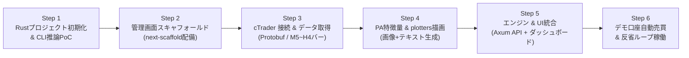

# 04. ロードマップ & 確定技術スタック

## 1. 確定技術スタック

ユーザー環境（Rust 1.98 & Cargo完備）および堅牢な常駐運用、洗練されたUIの実現に向けて、以下の技術スタックを正式採用します。

```
[フロントエンド: 管理画面]
Next.js 16 (App Router) + React 19 + Tailwind CSS v4 + shadcn/ui
(bee8 プロジェクトの next-scaffold をベースに複製・構築)
       ↕ HTTP REST / SSE (localhost:4000)
[バックエンド: コアエンジン]
Rust 1.98 (Tokio 非同期ランタイム + Axum Webフレームワーク)
       ├── cTrader Open API (Protobuf / TLS ソケット通信)
       ├── チャート画像生成 (plotters クレート)
       ├── LLM推論 (ローカルCLI: claude -p / agy -p パイプ連携)
       └── 永続化 (SQLite: rusqlite / sqlx)
```

### なぜこのスタックなのか？
1. **Rustの堅牢性と安全性**:
   - 24時間常駐する金融取引ボットにおいて、型安全性・メモリ安全性・ランタイムエラー（クラッシュ）の排除は最重要要件。
   - `tokio` による非同期I/Oで、cTraderのHeartbeat（Ping/Pong）やリアルタイムTick受信を極めて安定して処理可能。
2. **純Rustでのチャート描画 (`plotters`)**:
   - Python環境を介さず、Rust単体でプライスアクション専用のマルチタイムフレームローソク足チャート（PNG）を高速生成可能。
3. **`next-scaffold` による洗練された管理画面**:
   - 金融UIに必須のダークモード、`DashboardLayout`（サイドバー＋ヘッダー）、shadcn/ui（Table, Card, Dialog等）が完成しており、UI構築コストを最小化。
   - LLMの思考プロセス（CoT）を視覚的に追跡できるUIを即座に実現。

---

## 2. 開発ロードマップ（改訂版）



### Step 1: Rust プロジェクト初期化 & CLI推論PoC (最優先)
- `Cargo.toml` の作成（`tokio`, `serde`, `serde_json`, `plotters`, `axum` など）。
- サンプルのプライスアクションデータ（JSON）を `claude -p` または `agy -p` に流し込み、期待するJSONフォーマットで確信度・SL/TP・判断根拠が安定して返ることを確認するCLIモジュールを作成。

### Step 2: 管理画面（`next-scaffold`）の複製・配備
- `/Users/nodataiki/bee8/bee8-workspace/bee8/scaffold/next-scaffold` から本リポジトリの `dashboard/` へベースコードをコピー。
- トレード監視用（ポジション一覧、残高Card、CoTダイアログ、稼働トグルスイッチ）のダッシュボードUIを配置。

### Step 3: cTrader Open API 接続とヒストリカルデータ取得
- 提供された Client ID / Secret / Token を使って、cTrader Open APIとSSL/TLS接続。
- USD/JPY, EUR/USD の直近バーデータ（5M〜4H）を取得・保存できるモジュールを作成。
- デモ口座に対する最小単位のテスト注文（成行 + SL/TP）の疎通確認。

### Step 4: プライスアクション特徴量 & `plotters` 描画
- 取得したバーデータから、ヒゲ比率・実体比率・サポレジ判定（テキスト特徴量）を計算。
- `plotters` を用いて、4H/1H/15M/5M の4分割チャートPNG画像を生成するパイプラインを構築。

### Step 5: Rustコアエンジン（Axum API）とNext.js管理画面の結合
- Rust側に `axum` で軽量APIサーバー（`/api/status`, `/api/positions`, `/api/trades`, `/api/logs` 等）を実装。
- Next.js管理画面からローカルAPIを叩き、リアルタイムにポジションやLLMの思考ログが表示されることを確認。

### Step 6: 自律売買ループ & 自己反省（Self-Reflection）
- 5分足確定ごとに「データ更新 → 特徴量/画像生成 → LLM推論 → リスクガード → 発注（デモ口座）」を実行。
- 約定・決済結果から自己反省プロンプトを走らせ、`lessons_learned.json` を更新する改善サイクルを稼働。
