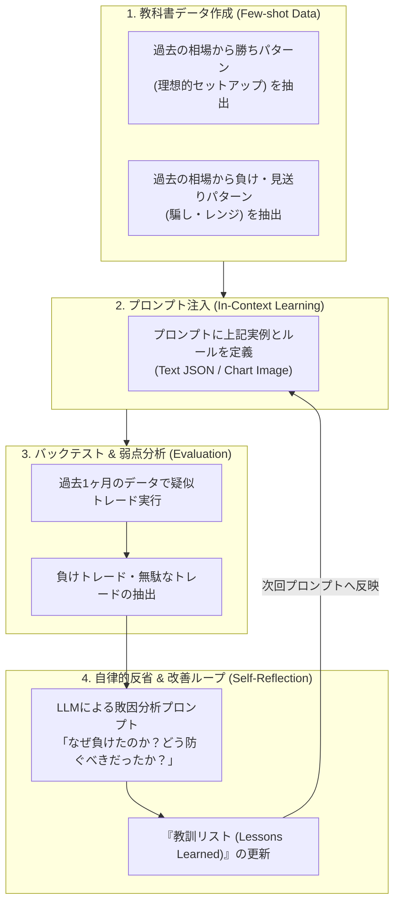

# 05. AI学習プロセス & プロンプト改善サイクル

## 1. LLMにおける「学習」の定義

従来の機械学習（LightGBM, LSTM等）では「過去のローソク足数万本をモデルに流し込み、パラメータ（重み）を更新すること」を学習と呼びました。
しかし、本システムで利用するLLM（Claude, Gemini, ChatGPT等）は、すでに世界中のテクニカル分析理論、市場力学、プライスアクション、経済学の知識を**事前学習（Pre-training）済み**です。

したがって、本プロジェクトにおける「学習工程」とは、**モデルの重みを再計算することではなく、以下の3つのループを通じてモデルの判断精度を適応・向上させること**を指します。



---

## 2. 教科書データ（Few-shotサンプル）の作成手法

対象通貨ペア（USD/JPY, EUR/USD）の過去チャートから、以下の代表的パターンを各3〜5例ピックアップし、プロンプトのコンテキストに組み込みます。

### A. 勝ちパターン例（A級セットアップ）
- **上位足順張り＋下位足ブレイク**:
  - 4H・1Hがパーフェクトオーダー（EMA20 > EMA50 > EMA200）。
  - 15Mで押し目をつけてEMA50で下ヒゲをつけて反発。
  - 5Mで直近高値を陽線ブレイク。
  - **期待される判断**: `action: BUY`, `confidence >= 0.85`, `stop_loss`: 15M押し安値直下。

### B. 見送りパターン例（騙し・レンジ・指標前）
- **高値掴み・レンジ上限**:
  - 4H・1Hですでに上昇が数日間継続し、RSIが買われすぎ水準。
  - 15M・5Mで上ヒゲが連続し、上値が重い。
  - **期待される判断**: `action: HOLD`, `reasoning`: 「上昇余地に対してリスクリワードが悪く、直近高値での反落リスクが高い」。
- **経済指標発表直前**:
  - スプレッド拡大リスク、ボラティリティ急変リスクがあるため `action: HOLD`。

---

## 3. 自己反省ループ（Self-Reflection）の実装

トレードが完了（利確または損切り）した際、自動で「反省プロセス」を起動します。

### 反省プロンプトの例
```markdown
# Role
あなたは客観的かつ厳格なプロFXトレーダー兼リスクアナリストです。

# Context
以下のトレードは「ストップロス（損切り）」で終了しました。
- 通貨ペア: USDJPY
- エントリー時の判断理由: {entry_reasoning}
- エントリー価格: 154.20, SL: 154.00, 決済価格: 153.98
- エントリー時の各時間足の状況: {entry_market_state}
- その後の価格推移チャート/データ: {post_trade_market_state}

# Task
1. なぜこのトレードは失敗したのか、根本的な原因を分析してください（例: 上位足の抵抗帯を見落としていた、レンジ中での中途半端な飛び乗りだった、等）。
2. 今後同様の負けを防ぐために、エントリールールまたは見送り条件に追加すべき「具体的かつ簡潔な1文のルール」を提示してください。
```

### 教訓（Lessons Learned）データベースの蓄積
LLMが出力した改善ルールは、`data/lessons_learned.json` に蓄積されます。
次回の推論時に、この教訓リストの上位（または直近に効くもの）をプロンプトの「注意事項・禁止事項」として自動挿入します。

これにより、**システムが自動でトレード日誌をつけ、過去の失敗を繰り返さないように自律進化する仕組み**を実現します。

---

## 4. 過学習（カーブフィッティング）の防止策

金融相場において「過去のデータに完全に合わせる」ことは最大の罠です。過去データで勝率100%のルールを作ると、未来の相場では必ず破産します。

これを防ぐため、以下の原則を厳守します：

1. **ルールのシンプル化（KISS原則）**:
   - プロンプトの条件分岐を細かくしすぎない（「〇〇が53.2以上で××が-0.15以下…」のような数値の過度なこじつけを排除）。
2. **Walk-Forward 検証（未知データでのテスト）**:
   - 例えば「2025年1月〜6月のデータ」でプロンプトを調整した場合、必ず「2025年7月〜9月の未使用データ」でテストし、未知の相場でも機能するか確認する。
3. **確信度閾値による選別**:
   - 微妙な相場では無理に取引させず、「見送り（HOLD）」を推奨するバイアスをあらかじめプロンプトに持たせる。
