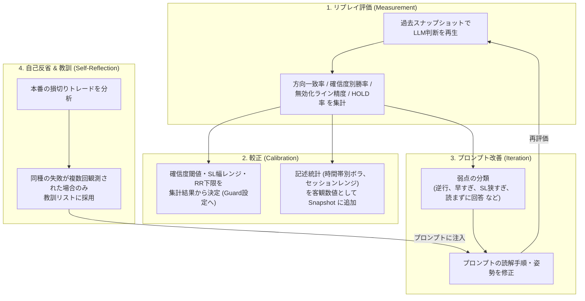

# 05. AI学習プロセス & プロンプト改善サイクル

## 1. LLMにおける「学習」の定義

従来の機械学習（LightGBM, LSTM等）では「過去のローソク足数万本をモデルに流し込み、パラメータ（重み）を更新すること」を学習と呼びました。
しかし、本システムで利用するLLM（Claude, Gemini, ChatGPT等）は、すでに世界中のテクニカル分析理論、市場力学、プライスアクション、経済学の知識を**事前学習（Pre-training）済み**です。

したがって、本プロジェクトにおける「学習工程」とは、**モデルの重みを再計算することではなく、過去データでLLMの判断を測り、閾値と文脈情報を数字で決め、失敗から教訓を蓄積すること**を指します。



### やらないこと
- **エントリー予測モデルの訓練**（勾配ブースティング、LSTM等）: ローソク足特徴量から方向を当てる分類器を作るのは、設計方針で捨てた「定量ロジック」への回帰です。5分足のFXは信号が薄く、検証期間で良く見えて実運用で崩れるのが典型です。
- **LLMのファインチューニング**: 「良いトレードだった」というラベル自体が主観であり、勝ったトレードが正しい判断だったとは限りません。ノイズを学習させるだけになります。

---

## 2. リプレイ評価と較正

学習工程の中核です。仕組みの詳細は [06_replay_environment.md](./06_replay_environment.md) に置き、ここでは「何を測って何を決めるか」を定義します。

### 測る指標
| 指標 | 定義 | 使い道 |
| :--- | :--- | :--- |
| 方向一致率 | BUY/SELL 判断後 N 本以内の値動きが判断方向と一致した割合 | プロンプトの読解品質 |
| TP先行率 | SL到達前にTP到達した割合 | 実質的な勝率 |
| 確信度別勝率 | 確信度を 0.1 刻みで分け、各帯の TP先行率 | 確信度閾値の較正 |
| 無効化ライン精度 | SL到達後に判断方向へ戻った割合（狭すぎの検出）、SL幅のATR比分布 | SL幅ガードの較正 |
| HOLD率 / 条件付きプラン成立率 | 見送りの多さと、待ち条件が実際に成立した割合 | 慎重さの適正化 |
| 観測不一致率 | `observed` が実際の最新足と一致しなかった割合 | 画像を読まずに答えた頻度 |
| 反対材料の記載率 | `conflicts` が空でない割合 | 片側の根拠だけ並べる出力の検出 |

### 決めるもの
- **確信度閾値**: 「確信度0.75以上」は根拠のない値です。確信度別勝率を見て、勝率が期待値を上回る帯から閾値を決めます。確信度0.8と言いながら勝率が5割なら、閾値を上げるかロットを落とすかを数字で判断します。
- **SL幅の許容レンジ（ATR比）**: SL到達後に戻った割合が高い帯は「狭すぎ」なので下限を上げます。
- **Snapshot に追加する記述統計**: 時間帯別の平均ボラティリティ、セッションごとの典型レンジ、ATRの過去パーセンタイル。これらは判定を含まない事実であり、「今は普段の半分しか動いていない」という文脈を与えます。

### 検証の原則
- **Walk-Forward**: プロンプト調整に使った期間とは別の未使用期間で必ず再評価します。
- **未来漏れの禁止**: 時刻 `t` のスナップショットには `t` 以前のバーしか含めません。テストで保証します。
- **同一 Snapshot 経路**: リプレイと本番で LLM が見るものを一致させます。リプレイ専用の簡略入力は作りません。

### Few-shot（過去の類似局面の提示）について
似た形のチャートと結果を数例見せる方法は、効く可能性はありますが、後知恵で選んだ例を見せると「この形は勝つ」という思い込みを植え付けます。**リプレイで効果を確認できた場合のみ採用**し、初期段階では使いません。

---

## 3. 自己反省ループ（Self-Reflection）の実装

トレードが完了（利確または損切り）した際、自動で「反省プロセス」を起動します。

### 反省プロンプトの例
```markdown
# Role
あなたは客観的かつ厳格なプロFXトレーダー兼リスクアナリストです。

# Context
以下のトレードは「ストップロス（損切り）」で終了しました。
- 通貨ペア: USDJPY
- エントリー時の判断理由: {entry_reasoning}
- エントリー価格: 154.20, SL: 154.00, 決済価格: 153.98
- エントリー時の各時間足の状況: {entry_market_state}
- その後の価格推移チャート/データ: {post_trade_market_state}

# Task
1. なぜこのトレードは失敗したのか、根本的な原因を分析してください（例: 上位足の抵抗帯を見落としていた、レンジ中での中途半端な飛び乗りだった、等）。
2. 今後同様の負けを防ぐために、エントリールールまたは見送り条件に追加すべき「具体的かつ簡潔な1文のルール」を提示してください。
```

### 教訓（Lessons Learned）の採用ルール
LLMが出力した改善ルールは、まず「候補」として保存し、次の条件を満たした場合のみプロンプトに注入する「採用済み」に昇格させます。1回の負けから教訓を作ると迷信が溜まるためです。

- **反復性**: 同種の失敗（反省プロンプトが同じ分類を返したもの）が一定期間内に複数回（初期値: 3回）観測された。
- **上限**: 採用済み教訓は最大10件。超える場合は最も古いか、最も効いていないものを落とす。
- **効果検証**: 採用後、リプレイで「教訓あり」「教訓なし」を比較し、改善が見られなければ無効化する。
- **表現**: 「〇〇の場合は必ずHOLD」のような絶対ルールではなく、「〇〇の局面では△△に注意して判断する」という読解上の注意として書く。絶対ルールはガードの領域であり、プロンプトに置くとLLMの判断を再び狭める。

管理画面の教訓マネージャーで候補・採用済み・無効化の状態を閲覧・編集できます。

実装（`src/reflection`, `src/scheduler`）: 損切りトレードの決済後に反省プロンプトを実行し、`decision_was_sound` が false かつ lesson が空でない場合のみ候補として保存します。採用は `maybe_adopt`（閾値 3 件、上限 10 件）で機械的に行います。

これにより、**システムが自動でトレード日誌をつけ、過去の失敗を繰り返さないように自律進化する仕組み**を、迷信の蓄積を防ぎながら実現します。

---

## 4. 過学習（カーブフィッティング）の防止策

金融相場において「過去のデータに完全に合わせる」ことは最大の罠です。過去データで勝率100%のルールを作ると、未来の相場では必ず破産します。

これを防ぐため、以下の原則を厳守します：

1. **ルールのシンプル化（KISS原則）**:
   - プロンプトの条件分岐を細かくしすぎない（「〇〇が53.2以上で××が-0.15以下…」のような数値の過度なこじつけを排除）。
2. **Walk-Forward 検証（未知データでのテスト）**:
   - 例えば「2026年4月〜6月のデータ」でプロンプトを調整した場合、必ず「2026年7月〜8月の未使用データ」でテストし、未知の相場でも機能するか確認する。
3. **確信度閾値による選別**:
   - 微妙な相場では無理に取引させず、「見送り（HOLD）」は失敗ではないという姿勢をプロンプトに持たせる。閾値そのものはプロンプトではなくガードに置き、リプレイで較正した値を使う。
4. **判定をプログラムに戻さない**:
   - リプレイで「〇〇の形は負けやすい」と分かっても、それをプログラムの事前フィルタとして実装しない。教訓としてプロンプトに注意を書くか、ガード（リスク管理）として表現できる場合のみガードに追加する。
