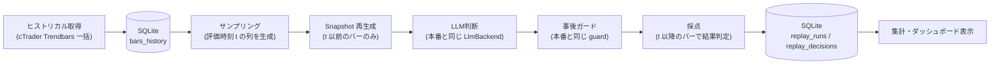

# 06. リプレイ環境（LLM判断の評価・較正基盤）

## 1. なぜ本番稼働より先に必要か

判定ロジックをプログラムから外し、LLMの裁量に委ねる設計では、従来の「ルールをコードにして過去データで回す」バックテストが成立しません。
プロンプトを1行変えたとき、それが改善なのか改悪なのかを判断する手段がなければ、開発は感想戦になります。

リプレイ環境は次の3つのために使います。

1. **測定**: 過去の任意時刻でLLMに判断させ、その後の値動きで採点する。
2. **較正**: 確信度閾値、SL幅の許容レンジ、RR下限といったガードの数値を集計結果から決める。
3. **回帰検証**: プロンプト・Snapshot・ガードを変更したとき、同じ期間で再実行して比較する。

---

## 2. 構成



### 本番との共有
- `snapshot`、`llm`、`guard` は本番と同じモジュールを使います。リプレイ専用の簡略版は作りません。
- 違いは「現在時刻の代わりに `t` を渡す」「cTraderの代わりに `bars_history` からバーを読む」の2点だけです。バー供給元は `BarSource` トレイトで抽象化します。

---

## 3. ヒストリカルデータ

### 取得
- cTrader Open API の Trendbars 取得を期間指定で繰り返し呼び、5M / 15M / 1H / 4H を対象ペアごとに保存します。
- 初期範囲: 対象ペア（USDJPY, EURUSD）の直近3ヶ月。5Mで約 26,000 本/ペア。
- 取得はCLIコマンドとして用意し、差分取得（保存済み最終時刻以降のみ）に対応させます。

### 保存スキーマ
```sql
CREATE TABLE bars_history (
  pair       TEXT    NOT NULL,
  period     TEXT    NOT NULL,   -- M5 / M15 / H1 / H4
  ts         INTEGER NOT NULL,   -- 足の開始時刻 (UTC epoch秒)
  open  REAL NOT NULL, high REAL NOT NULL, low REAL NOT NULL, close REAL NOT NULL,
  volume     INTEGER,
  PRIMARY KEY (pair, period, ts)
);
```

### スプレッド
過去のスプレッドは Trendbars からは得られません。リプレイでは「時間帯別の代表スプレッド」（例: 東京 0.3、ロンドン 0.2、深夜 0.8 pips）を設定値として使い、`spread_pips` として Snapshot に渡します。実測に置き換えたい場合は本番稼働中にTickから記録した値を使います。

---

## 4. 未来漏れの防止

時刻 `t` の Snapshot に `t` より後の情報が混入すると、評価結果は全て無意味になります。

- **確定足のみ**: `t` 時点で確定している足だけを使います。5M足の「確定」は開始時刻 + 5分が `t` 以下であること。上位足も同じ規則で、例えば 4H 足は開始 + 4時間が `t` 以下の足のみ。
- **前日高安・当日高安**: `t` 時点までの足から算出します。当日高安は「`t` までの当日の高安」であり、その日の最終的な高安ではありません。
- **スイング検出**: 左右 `window` 本で極値を判定するため、最新 `window` 本はスイングとして確定できません。本番と同じ規則で「`t` 時点で確定しているスイング」だけを出します。
- **テスト**: 任意の `t` で生成した Snapshot に含まれる全ての時刻が `t` 以下であることを検証するプロパティテストを置きます。

---

## 5. サンプリング

全ての5M確定でLLMを呼ぶと3ヶ月で約 26,000 回になり、コストと時間が現実的ではありません。

- **初期方針**: 15分おき（各15M確定時）にサンプリング。3ヶ月で約 8,600 回/ペア。
- **さらに絞る場合**: セッション（東京・ロンドン・NY）ごとに均等に抽出し、合計 1,000〜2,000 回程度から始めます。
- **条件付きプランの評価**: LLMが `conditional_plan` を返した場合、次の評価時刻を待たずに、以降の5M足で `wait_for` / `invalidate_if` / `expires_at` を機械的に評価し、成立時点をエントリーとして採点します。これは本番の `executor` と同じロジックです。
- **並列化**: `claude -p` の同時実行数はレート制限に合わせて設定値で制御します（初期値: 2）。

---

## 6. 採点

### エントリー判断（BUY / SELL）
判断時刻 `t` のエントリー価格・SL・TP を使い、`t` 以降の5M足を順に走査します。

| 結果 | 判定 |
| :--- | :--- |
| `TP_HIT` | SL到達前に TP に到達 |
| `SL_HIT` | TP到達前に SL に到達 |
| `TIMEOUT` | 一定本数（初期値: 48本 = 4時間）以内にどちらにも到達しない。終値との差で損益を記録 |
| `SAME_BAR` | 同一足で SL と TP の両方に触れた。保守的に SL_HIT として扱う |

同一足内の到達順序は5Mバーでは判別できないため、`SAME_BAR` は不利側に倒します。

### 見送り判断（HOLD）
- HOLD 自体は採点しませんが、「HOLDした時刻の直後に大きく動いたか」を記録し、**見送りすぎ**の傾向を把握します。
- 条件付きプランは、成立した場合はエントリー判断として採点し、期限切れ・無効化は `PLAN_EXPIRED` / `PLAN_INVALIDATED` として記録します。

### 判断品質の補助指標
- **観測整合**: `observed` の時刻が実際の最新足と一致するか。不一致は `UNOBSERVED` として別集計し、勝率計算からは除外します。
- **反対材料**: `conflicts` が空か。
- **ガード結果**: どのガードで弾かれたか。弾かれた判断もその後の値動きで採点し、**ガードが正しい判断を弾いていないか**を検証します。

---

## 7. 保存と集計

```sql
CREATE TABLE replay_runs (
  id            INTEGER PRIMARY KEY,
  created_at    INTEGER NOT NULL,
  label         TEXT,                 -- 例: "prompt-v3 / snapshot-v2"
  pair          TEXT NOT NULL,
  from_ts       INTEGER NOT NULL,
  to_ts         INTEGER NOT NULL,
  sampling      TEXT NOT NULL,        -- "15m" / "session-balanced:1500"
  prompt_hash   TEXT NOT NULL,
  snapshot_ver  TEXT NOT NULL,
  guard_config  TEXT NOT NULL         -- JSON
);

CREATE TABLE replay_decisions (
  run_id        INTEGER NOT NULL REFERENCES replay_runs(id),
  t             INTEGER NOT NULL,
  decision_json TEXT NOT NULL,        -- TradeDecision 全文
  guard_result  TEXT NOT NULL,        -- PASS / <guard name>
  outcome       TEXT NOT NULL,        -- TP_HIT / SL_HIT / TIMEOUT / SAME_BAR / HOLD / PLAN_* / UNOBSERVED
  pnl_pips      REAL,
  bars_to_exit  INTEGER,
  chart_dir     TEXT NOT NULL,        -- 生成した画像4枚の保存先
  PRIMARY KEY (run_id, t)
);
```

### 集計ビュー
- 確信度帯（0.1刻み）ごとの件数・TP先行率・平均損益。
- セッション別、曜日別の同上。
- SL幅（ATR比）帯ごとの `SL_HIT` 後の反転率。
- ガード別の「弾いた件数」と「弾いた判断の仮想損益」。
- 2つの `run_id` を並べた差分表示（プロンプト変更前後の比較）。

### 画像の保持
リプレイ1回あたり数千枚の画像が生成されます。`charts/replay/<run_id>/<t>/` に保存し、ダッシュボードから「この判断のときLLMが見た画像」を開けるようにします。古い run の画像は手動削除とし、DBの行は残します。

---

## 8. CLI

```
cargo run --bin replay -- fetch  --pair USDJPY --from 2026-06-01 --to 2026-09-01
cargo run --bin replay -- run    --pair USDJPY --from 2026-06-01 --to 2026-07-31 --sampling 15m --label "prompt-v3"
cargo run --bin replay -- report --run 12
cargo run --bin replay -- diff   --run 11 --run 12
cargo run --bin replay -- check-leak --pair USDJPY --samples 200   # 未来漏れテスト
```

---

## 9. 開発順序

1. `bars_history` テーブルと `fetch` コマンド。
2. `BarSource` トレイトと、`bars_history` から `t` 以前の確定足を返す実装。
3. `snapshot` を `BarSource` 経由で動かし、`check-leak` で未来漏れがないことを確認。
4. `run` コマンド（サンプリング → Snapshot → LLM → Guard → 採点 → 保存）。まず 50 サンプルで疎通確認。
5. `report` / `diff` と、ダッシュボードのリプレイ結果ビューア。
6. 3ヶ月分を回して確信度閾値と SL 幅レンジを較正し、ガード設定に反映。
